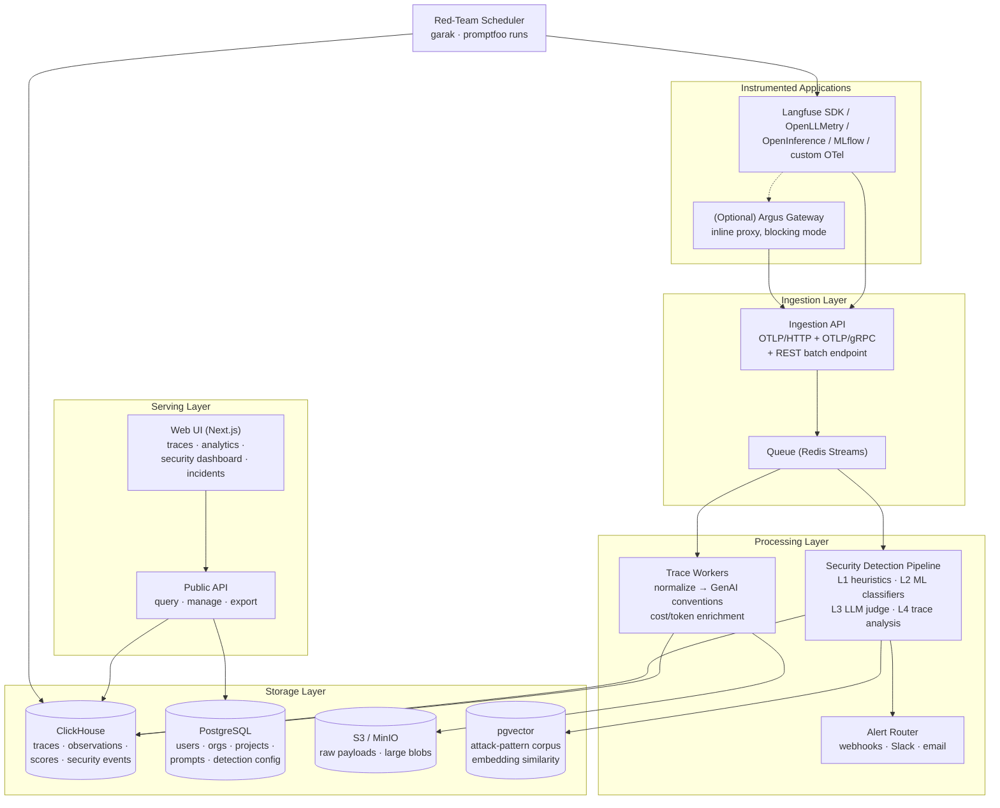

# 02 — Architecture

## System overview

## Components

### 1. Ingestion API

- **Protocols:** OTLP/HTTP and OTLP/gRPC (primary), plus a Langfuse-compatible
  REST batch endpoint (adoption shortcut — existing Langfuse users can point
  their SDK at Argus by changing the base URL).
- **Semantic conventions:** [OpenTelemetry GenAI semantic conventions](https://opentelemetry.io/docs/specs/semconv/gen-ai/)
  (`gen_ai.*` attributes) are the canonical internal representation. Adapters
  normalize OpenInference and Langfuse formats into it.
- Stateless; horizontally scalable; writes to the queue and returns `202`.
- Large payloads (full prompts/completions, retrieved documents) are offloaded
  to S3/MinIO with a pointer in the event, keeping the queue lean.

### 2. Queue

- **Redis Streams** for MVP (one less moving part; Langfuse does the same).
- Two consumer groups: `trace-workers` and `security-workers`, so security
  processing never blocks trace availability and can lag under load without
  affecting the core product.
- Kafka is the documented scale-out path if a deployment exceeds Redis
  comfort; the worker code consumes an abstract stream interface.

### 3. Trace workers

- Normalize spans to the internal model ([05 — Data Model](05-data-model.md)).
- Enrich: token counting (when SDK didn't report), cost calculation from a
  model-pricing table, session/user stitching.
- Batch-insert into ClickHouse (async inserts, 1–5s flush).

### 4. Security detection pipeline (the differentiator)

Consumes the same stream, runs the four detection layers, and writes
`security_events` rows. Full design in
[04 — Security Detection Engine](04-security-detection-engine.md). Key
architectural properties:

- **Async by default** — detection latency does not affect app latency.
- **Layered escalation** — L1 (regex/heuristics, µs) runs on all content;
  L2 (transformer classifiers, ~10–50 ms on CPU/GPU) runs on all *untrusted*
  content and L1 escalations; L3 (LLM judge) and L4 (trace-graph analysis)
  run only on escalations and trace completion.
- **Model serving:** classifiers (Prompt Guard 2, DeBERTa injection models)
  served via a small internal inference service (Text Embeddings Inference or
  ONNX Runtime); LLM judge calls any OpenAI-compatible endpoint (self-hosted
  vLLM/Ollama or a commercial API — operator's choice).

### 5. Alert router

- Consumes high-severity `security_events`, applies dedup/rate-limit/
  suppression rules (stored in Postgres), fans out to webhook, Slack, email,
  PagerDuty.
- Every alert payload contains the trace URL, span ID, matched content
  excerpt, and detection-layer provenance.

### 6. Storage

| Store | Holds | Why |
|---|---|---|
| **ClickHouse** | traces, observations, scores, security events, red-team results | High-volume append, fast analytical queries. Proven by Langfuse at scale ([ClickHouse on LLM observability](https://clickhouse.com/resources/engineering/llm-observability)). |
| **PostgreSQL** | orgs, users, projects, API keys, prompt versions, detection config, suppression rules | Transactional metadata. |
| **S3 / MinIO** | raw event payloads, large documents, media | Cheap blob storage; ClickHouse rows keep pointers. |
| **pgvector** (Postgres extension) | embeddings of known attack patterns + confirmed incidents | Rebuff-style self-hardening similarity search without adding a dedicated vector DB. |

### 7. Web UI

Next.js + TypeScript. Views:

- **Traces** — waterfall/tree view, span detail, GenAI attribute rendering.
  Security annotations are overlaid *on the trace view* (tainted spans tinted,
  detection hits flagged inline).
- **Analytics** — cost, tokens, latency, model usage.
- **Security dashboard** — attack feed, severity histogram, top targeted
  endpoints, attacker session clusters, detection-layer hit rates,
  false-positive review queue.
- **Incidents** — grouped related events with a timeline; analyst workflow
  (acknowledge / confirm / false-positive), which feeds the corpus.
- **Prompts / Evals / Datasets** — Langfuse-parity features.

### 8. Optional gateway mode (phase 3+)

A lightweight reverse proxy (OpenAI-compatible API surface) deployed in front
of model providers. Runs L1+L2 synchronously (budget: <50 ms p99) and can
block/redact per policy. Shares detection config and reporting with the async
pipeline. Explicitly optional — the platform is fully functional observe-only.

### 9. Red-team scheduler

Cron-style runner that executes [garak](https://github.com/NVIDIA/garak)
probes and [promptfoo](https://github.com/promptfoo/promptfoo) red-team suites
against a designated app endpoint, ingests results as traces + scores, and
charts attack-success-rate over time (security regression testing).

## Deployment modes

1. **Evaluation:** single `docker compose up` — all services, ClickHouse,
   Postgres, Redis, MinIO on one host.
2. **Production self-hosted:** Helm chart; ClickHouse/Postgres either
   in-cluster or managed (ClickHouse Cloud, RDS).
3. **Detection-only sidecar (adoption wedge):** run just the security
   pipeline + dashboard against an *existing* Langfuse or OTel collector
   export. Lets teams add Argus security without migrating observability.
   (See roadmap — this is deliberately the MVP shape.)

## Multi-tenancy & security of the platform itself

- Org → Project hierarchy; API keys scoped per project (public/secret pair).
- All queries tenant-filtered at the API layer; ClickHouse row policies as
  defense in depth.
- Prompt/completion payloads are sensitive: encryption at rest (S3 SSE,
  ClickHouse disk encryption), configurable retention TTLs per project,
  optional field-level redaction at ingestion (PII scrubbing before storage).
- Audit log of all analyst actions (Postgres).
- The platform must assume **its own stored content is hostile** (it stores
  attack payloads by design): strict output encoding in the UI, no
  `dangerouslySetInnerHTML` on trace content, CSP headers — a stored prompt
  injection must never become stored XSS.
