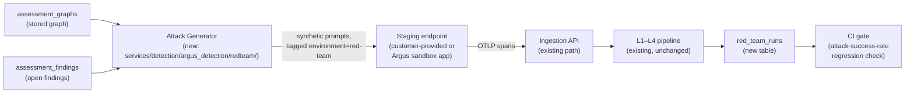
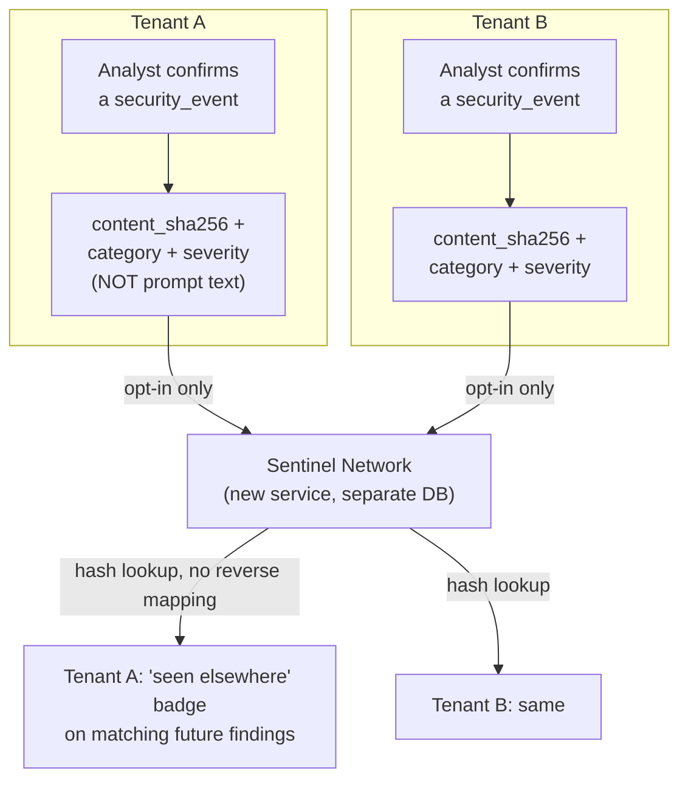
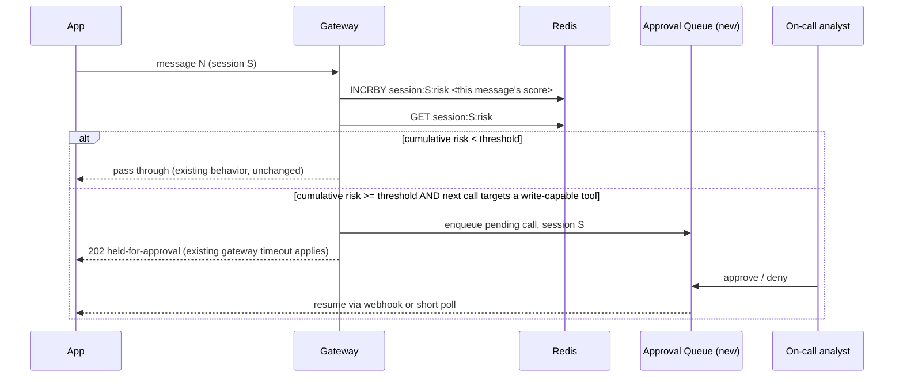
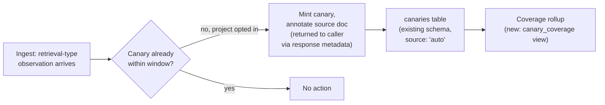
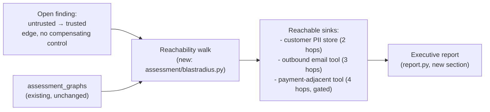
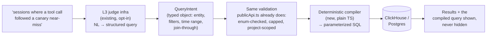

# 15 — Platform Evolution: Six Proposals for the Next Moat

**Status: proposal, not committed.** Nothing in this document is scheduled or
approved for implementation. It exists to be argued with, cut, reordered, and
turned into real roadmap entries in [docs/06](06-roadmap.md) once a subset is
chosen.

## Why these six, and not others

Argus's actual differentiator is not "has security detection" — LLM Guard,
Prompt Guard and NeMo Guardrails all have that. It is the **synthesis loop**:
runtime evidence changes static risk (`observed_in_production`,
[assessmentSynthesis.ts](../apps/web/src/assessmentSynthesis.ts)) and static
structure changes what runtime detection can reason about (trace-derived
architecture graphs, the taxonomy bridge in
[assessment/taxonomy.py](../services/detection/argus_detection/assessment/taxonomy.py)).
Every proposal below either **closes a loop that's currently open** or
**scales a detector that's currently bottlenecked on a human**. None of them
are observability-parity work (evals, prompt management, SSO) — that's
already correctly scoped in [docs/06](06-roadmap.md) Phase 3 as table stakes,
not moat.

| # | Proposal | Loop it closes / bottleneck it removes |
|---|---|---|
| 1 | Architecture-aware continuous red-teaming | Static → runtime is currently one-way (assessment informs risk, but never *generates* traffic) |
| 2 | Cross-tenant threat intelligence network | `content_sha256` correlation is scoped to one project; the highest-value data (confirmed attacks) never leaves the tenant that saw it first |
| 3 | Session-level gateway circuit breaker | The gateway judges one message with no memory; "write tools need human approval" is an assessment-time *finding*, never an enforcement point |
| 4 | Automated canary fleet + coverage | Canaries are Argus's only zero-false-positive detector, and today they require a human to plant each one by hand |
| 5 | Blast-radius / business-risk simulator | The risk score is a number; nobody outside security reads a 0–100 scale as "here's what's actually exposed" |
| 6 | Natural-language query copilot | The data (traces, findings, taxonomy-linked evidence) is unusually rich, but only reachable through fixed dashboard views |

---

## 1. Architecture-aware continuous red-teaming

### Problem

[docs/06](06-roadmap.md) Phase 4 already names a "red-team scheduler" wired to
garak/promptfoo. Generic attack corpora against a generic endpoint is
table-stakes red-teaming — any competitor can ship that. What nobody else can
ship is a red-teamer that reads the **same architecture graph and open
findings** the assessment engine already produced for this specific
application, and shapes attacks around them: if `IG-PROMPT-012` fired because
there's a write-capable tool with no human-approval gate, generate attacks
that specifically try to reach that tool through the identified untrusted
input path — not a generic jailbreak corpus.

### Design



The generator is a **new, narrow** component — it does not touch detection.
It reads `assessment_graphs` + `assessment_findings` for a project (same
tables `assessments.ts` already queries) and produces prompts targeted at:

- edges in the graph marked `untrusted → trusted` with no compensating
  control (`graph.py` insight rules already identify these — the generator
  just needs the same edges, not new analysis)
- open findings' `rule_id` + `category`, mapped through a small
  rule-id → attack-template table (deterministic, not LLM-generated — keeps
  this auditable and keeps it out of the "another opaque LLM in the loop"
  trap)

Attacks are fired through the **existing ingestion path**, tagged with
`environment: "red-team"` — precedent already exists for this pattern (the
Browser Guard extension's reports land in the `browser-extension`
environment, per [docs/14 §12](14-merged-features.md)). This means red-team
traffic gets taint classification, L1–L4 scoring, and dashboard visibility
for free, filtered out of production views by environment exactly like
extension reports already are.

### Data model

New Postgres table `red_team_runs` (mirrors `assessments` shape):

```sql
CREATE TABLE red_team_runs (
  id              uuid PRIMARY KEY DEFAULT gen_random_uuid(),
  project_id      uuid NOT NULL REFERENCES projects(id),
  triggered_by    text NOT NULL,           -- 'ci' | 'manual' | 'schedule'
  source_findings uuid[] NOT NULL,         -- assessment_findings this run targeted
  attacks_fired   int NOT NULL,
  attacks_blocked int NOT NULL,
  attacks_succeeded int NOT NULL,
  success_rate    numeric NOT NULL,
  baseline_run_id uuid REFERENCES red_team_runs(id),  -- for regression diffing
  created_at      timestamptz NOT NULL DEFAULT now()
);
```

### API surface

```
POST /api/redteam/run          member+  { target_url, max_attacks }
GET  /api/redteam/runs         project-scoped, cursor paged
GET  /api/redteam/runs/:id     one run + per-attack outcome, linked trace ids
```

A CI-facing variant, following the pattern the gateway already sets for
"fail safe by default": `POST /api/redteam/ci-gate` returns a plain exit-code
style verdict (`{"pass": bool, "regression": {...}}`) so a GitHub Action can
gate a merge without parsing dashboard JSON.

### Phasing

1. Deterministic rule-id → attack-template mapping, manual trigger only,
   against a customer-designated staging URL. No CI gate yet.
2. `baseline_run_id` diffing + the CI-gate endpoint.
3. Optional: broaden template generation past the deterministic table (still
   not customer prompt content — templates, not an LLM given free rein against
   someone's production system).

### Risks

- **This is the one proposal that sends traffic somewhere.** It must never
  fire against a production URL without the operator explicitly designating
  it as a red-team target — the opposite mistake of the gateway's fail-open
  design, but the same category of "don't take an unrequested action against
  a live system."
- Attack templates need their own quality gate, same spirit as
  `test_quality_gate.py` — a red-teamer that cries wolf gets its CI gate
  disabled within a sprint, which defeats the point.

---

## 2. Cross-tenant threat intelligence network

### Problem

`content_sha256` ([content.ts](../packages/shared/src/content.ts)) already
lets one project recognize "the same poisoned document showed up in a
different trace" — but only *within* that project. The moment two unrelated
Argus deployments see the same phishing-in-a-PDF or the same jailbreak
template (which, for anything that spreads — a poisoned public dataset, a
viral jailbreak prompt — is the common case, not the rare one), each rediscovers
it from zero. This is the proposal with the largest compounding value and the
largest trust surface, so it's written up in more detail on the consent model
than the mechanism.

### Design



**What crosses the boundary — and what deliberately never does:**

| Shared | Never shared |
|---|---|
| `content_sha256` (irreversible hash) | Prompt/document content |
| `category`, `severity` | Trace IDs, project IDs, org names |
| A coarse first-seen timestamp | Anything that could re-identify the source tenant |

This mirrors the discipline already in the codebase around canaries
(`packages/shared/src/canaries.ts`: "the raw value is written down once...
and never stored or sent anywhere again") and assessment evidence
(`assessment/redaction.py` scrubbing before evidence leaves the engine). The
network is a hash-lookup service, structurally incapable of reconstructing
the content even if it were compromised — there's nothing sensitive in a
sha256 and a severity enum.

### Data model

New service, **new database**, not a shared table in the existing Postgres —
this needs to be a hard boundary, not a `WHERE org_id != ...` filter that a
bug could cross:

```sql
-- Sentinel Network's own store
CREATE TABLE known_signatures (
  content_sha256   text PRIMARY KEY,
  category         text NOT NULL,
  max_severity     text NOT NULL,
  first_seen_at    timestamptz NOT NULL,
  report_count     int NOT NULL DEFAULT 1        -- how many tenants, never which
);
```

### API surface

```
POST /v1/sentinel/check     { hashes: string[] }  → { hash: { category, severity, known: bool } }[]
POST /v1/sentinel/report    { hash, category, severity }   -- opt-in, fire-and-forget
```

Called from the worker at the same point `securityWorker.ts` already computes
`content_sha256` per observation — this is an additive lookup, not a new
pipeline stage.

### Phasing — this one needs a decision before any code

1. **Decision required, not engineering**: opt-in default (off, per-org toggle
   in Settings) vs. opt-out. Given the "no data sharing without asking" posture
   the rest of this platform holds (see `ARGUS_SIGNUP_MODE`,
   `REQUIRE_EMAIL_VERIFICATION`, the entire tenant-isolation test suite),
   opt-in-only is the only defensible default — flag this explicitly for
   sign-off before scoping further.
2. Read-only lookup first (consume other tenants' signal, contribute nothing)
   — proves the value without any sharing decision on the reporting side.
3. Opt-in reporting, with the toggle surfaced next to the existing
   suppression-rules UI (`Manage → Alerts`), since it's the same audience
   making the same kind of "what leaves this tenant" decision.

### Risks

- Legal/ToS surface: this is the one proposal that needs a documented data
  processing description before it ships to anyone outside a design partner.
- Poisoning the network itself: a malicious or careless tenant could report
  garbage hashes. `report_count` and severity should require some minimum
  corroboration (e.g. ≥2 independent reporting orgs) before a hash surfaces
  as "known" to others — a single-tenant false positive shouldn't propagate.

---

## 3. Session-level gateway circuit breaker

### Problem

[gateway.ts](../packages/shared/src/gateway.ts) is deliberately, correctly
stateless and message-scoped — its own docstring explains why: fail-open,
hard latency budget, narrow blocking scope, because "this layer sees one
message with no trace context." That design is right for what the gateway
protects (production availability). But it means the concept threaded through
the entire architecture-graph analyzer — *write-capable tools need
human-approval gating* — has no live enforcement point. It's assessed
(`graph.py` insight rules), scored (`risk.py`), and reported, but never
actually gates a real tool call in production.

### Design

Add an **optional**, explicitly opt-in second mode alongside the existing
per-message gateway: session-scoped cumulative risk, tracked in Redis
(the same store the gateway and ingestion already depend on — no new
infra), that can escalate a *specific upcoming tool call* to a
human-approval queue instead of a binary allow/refuse.



Critically, this **does not weaken the existing fail-open guarantee.** The
per-message check is untouched; this is a second, additive check that only
activates for calls the architecture graph already flagged as
write-capable-without-approval — and if Redis or the queue is unavailable,
it fails open exactly like the rest of the gateway (`onFailure: "open"`
already models this decision; the session breaker reuses it rather than
inventing new failure semantics).

Which tools are "write-capable" is **not re-derived from wording** — it's the
same `can_write` flag `assessmentSynthesis.ts` already sets on trace-derived
graph components (tool names matching a side-effect vocabulary). One
source of truth for "this tool writes," used by both the static analyzer and
the runtime breaker.

### Data model

```sql
-- Postgres: the human-review side; Redis only holds the live counter
CREATE TABLE gateway_approval_queue (
  id            uuid PRIMARY KEY DEFAULT gen_random_uuid(),
  project_id    uuid NOT NULL REFERENCES projects(id),
  session_id    text NOT NULL,
  tool_name     text NOT NULL,
  cumulative_risk numeric NOT NULL,
  contributing_events text[] NOT NULL,   -- security_event ids that built the score
  status        text NOT NULL DEFAULT 'pending',  -- pending|approved|denied|expired
  decided_by    uuid REFERENCES users(id),
  created_at    timestamptz NOT NULL DEFAULT now(),
  expires_at    timestamptz NOT NULL      -- pending calls must not hang forever
);
```

### API surface

```
GET  /api/gateway/approvals              pending queue, project-scoped
POST /api/gateway/approvals/:id/decide   { decision: 'approve'|'deny' }   member+
```

Per-project config extends the existing pattern in
`DetectionConfig.gateway` (mode/threshold/categories, "inherit" as default —
[docs/14 §5](14-merged-features.md)): add `sessionBreakerEnabled: boolean`
and `sessionRiskThreshold: number`, same clamping discipline ("narrow but
never widen").

### Phasing

1. Observe-only: compute and log cumulative session risk, no enforcement —
   same "start in observe" discipline the message-level gateway already
   recommends operators follow.
2. Enforcement, opt-in per project, with a hard `expires_at` so a pending
   approval can never silently block an application forever (times out to
   the project's existing `onFailure` policy).
3. Webhook-based approval (Slack button → decide endpoint), reusing the
   alert-destination infrastructure already built for incidents.

### Risks

- This is the first place in the platform where a security control can add
  *latency to a legitimate write action*, not just observe or refuse. It
  needs its own explicit "start in observe" runbook entry, same tone as the
  existing gateway guidance, and a hard timeout is non-negotiable.

---

## 4. Automated canary fleet + coverage reporting

### Problem

Canaries are, by the codebase's own description, "the one signal that
justifies waking someone at 3am" — zero benign explanation for a hit. But
today, per [docs/13 §Canaries](13-feature-reference.md), planting one is a
fully manual act: label it, generate it, paste it somewhere, remember you did.
The platform's highest-precision detector is bottlenecked on someone
remembering to use it, and there is currently no way to answer "how much of
our retrieval surface is actually being watched?"

### Design

Two additive pieces, neither touching canary *matching* logic
(`CANARY_PATTERN` / hash comparison in
[canaries.ts](../packages/shared/src/canaries.ts) is unchanged):

**a) Auto-planting at ingestion.** When a project opts in, newly-ingested
retrieval-source documents (identified the same way taint classification
already identifies them —
[taint.py](../services/detection/argus_detection/taint.py):
`ObservationType.retrieval`) get a generated canary appended if one isn't
already present within a configurable token window. This is a worker-side
hook, not an SDK change — it operates on the same observation records
`traceWorker.ts` already normalizes.

**b) Coverage reporting.** A per-project metric: of all distinct retrieval
sources seen in the last N days, what fraction have a live (non-revoked)
canary within X tokens of *any* observed chunk. This is a read-only query over
existing `observations` + `canaries` data — no new detection, just a new
rollup, presented the way test-coverage tools present line coverage.



One deliberate constraint carried over from the existing design: **auto-planted
canaries only cover ingested content, never live retrieval results** — the
existing doc is explicit that alerting on your own retriever finding its own
canary "would make the feature unusable." Auto-planting only touches the
*source* side, same boundary the manual feature already respects.

### Data model

Extend `canaries` (migration `010_canaries.sql`) rather than a new table:

```sql
ALTER TABLE canaries ADD COLUMN source text NOT NULL DEFAULT 'manual';  -- 'manual' | 'auto'
ALTER TABLE canaries ADD COLUMN source_ref text;  -- doc identifier it was planted into, if auto
```

Coverage is a query, not stored state — recomputed on view, same pattern as
the existing cross-trace correlation panel.

### API surface

```
GET /api/canaries/coverage    { total_sources, covered_sources, pct, stale_sources[] }
```

`stale_sources` — retrieval sources with no canary at all, or whose canary was
revoked — is the actionable part; a single percentage without the list is a
vanity metric.

### Phasing

1. Coverage reporting only, against **existing manually-planted** canaries.
   Ships value with zero new write paths, and tells you today's baseline
   before auto-planting changes it.
2. Opt-in auto-planting for newly ingested retrieval sources.
3. Optional backfill tool for already-ingested sources (explicit, on-demand —
   not automatic, since it mutates a customer's document store, not just
   Argus's own data).

### Risks

- Auto-planting **writes into the customer's document/knowledge base**, not
  just into Argus. That's a materially different trust level than everything
  else in this doc, which only ever writes to Argus's own storage. Step 2
  needs its own explicit consent flow, separate from a normal feature toggle,
  and should ship a dry-run mode first (report what *would* be planted, plant
  nothing) before doing it live.

---

## 5. Blast-radius / business-risk simulator

### Problem

`risk.py` already produces a transparent, versioned 5-factor score, and
`graph.py` already knows the trust topology. But a finding surfaces as "risk:
78, high" — legible to a security engineer, not to the people who decide
budget or sign a compliance attestation. The inputs for "what's actually
exposed if this specific edge is exploited" already exist in the graph; they
just aren't traversed into an answer.

### Design

A reachability analysis over the **same graph structure** `analyze_graph`
already consumes (`GraphNode`/`GraphEdge` in
[assessment/models.py](../services/detection/argus_detection/assessment/models.py)):
starting from a node an open finding says is reachable by untrusted input,
BFS forward along `can_write` / data-flow edges to enumerate which sinks
(sensitive-data nodes, cross-tenant boundaries, external-egress tools) are
reachable, and at what depth.



This is pure graph traversal over data that's already validated and stored —
no new detection, no model calls, same "pure engine, no DB, no network"
discipline the rest of `assessment/` holds
([docs/14 §Prompt scanner](14-merged-features.md): "Everything under
`argus_detection/assessment/` is pure").

Output is deliberately **qualitative + hop-count, not a dollar figure.**
Assigning a dollar value to data exposure requires business context Argus
doesn't have (data classification, regulatory exposure, customer counts) and
inventing one would be exactly the kind of unfounded precision this
codebase's risk-scoring docstrings warn against elsewhere. "Reachable: the
customer PII store, in 2 hops, with no gate in between" is defensible;
"$4.2M at risk" is not, unless the customer supplies their own severity
mapping — which is a config input, not something to guess at.

### Data model

No new storage — this is computed at report-generation time from
`assessment_graphs` and `assessment_findings`, same as every other
`report.py` section.

### API surface

Extends the existing report generation rather than adding a new endpoint:

```
GET /api/reports/executive?format=pdf   -- gains a "Blast Radius" section
POST /api/assessment/graph/blast-radius -- ad-hoc query: "what's reachable from node X"
```

### Phasing

1. `blastradius.py` as a pure function + tests (mirrors how `graph.py` and
   `risk.py` shipped — engine first, golden tests, then wiring).
2. Surface in the existing report renderers (`report.py` already handles
   PDF/MD/CSV/JSON in one place; this is a new section, not a new format).
3. The ad-hoc "what's reachable from node X" query in the Architecture tab UI.

### Risks

- Low — this is the safest proposal in the set (no new writes, no new
  external calls, no new trust boundary). The main risk is scope creep into
  dollar-figure risk quantification, which should be explicitly declined
  unless a customer supplies their own valuation inputs.

---

## 6. Natural-language query copilot over trace + finding storage

### Problem

The data is unusually rich — traces, observations, and security events share
a taxonomy (`taxonomy.py`), findings carry full risk rationale, and canary
provenance is explicit. But it's only reachable through the fixed dashboard
views `queries.ts` and `publicApi.ts` expose. An analyst asking "show me
sessions where a tool call happened right after a canary near-miss" has no
way to ask that question today short of writing SQL against ClickHouse
directly.

### Design — the constraint that matters most

**The model never generates raw SQL against production ClickHouse/Postgres.**
That would be a direct contradiction of everything else in this codebase's
security posture — the fail-closed policy engine (`policy.py`: "unknown
fields and unknown operators never match"), the capped assessment requests
("an open engine can't become a free CPU oracle"), the public API's
`limit`-capped, filter-validated queries. An LLM-authored SQL string against
the same store that holds every customer's prompts and completions is the
single riskiest thing this document proposes, and it's avoidable.

Instead: a **constrained query DSL**, structurally similar to what
`publicApi.ts` already validates (`since`/`until`/`cursor`, enum-checked
filters, 400 on an unknown value rather than a silent empty result). The
model's only job is to translate natural language into an instance of this
DSL; the DSL compiler — plain code, not an LLM — is what turns it into a
parameterized query.



`QueryIntent` is a small closed schema (entity: trace|event|finding; filters:
category/severity/outcome/taint/time-range; an optional `sequence` construct
for "X followed by Y within N minutes," which is the one genuinely new query
shape this needs beyond what the dashboard already supports). If the model
produces something outside the schema, it's a validation error, not a
best-effort query — same "unknown filter value returns 400, not an empty
page" discipline the public API already holds, for the same reason: a
security tool that quietly returns "no results" for a malformed query is
worse than one that visibly fails.

**Always show the compiled query.** Never just the answer — an analyst
trusting a security finding needs to see what was actually asked, same
transparency principle the risk-scoring rationale already follows.

### Data model

None. This reads existing storage through the existing project-scoping
discipline (every query already named-project-in-WHERE per
[docs/14](14-merged-features.md)); it adds no tables.

### API surface

```
POST /api/query/ask       member+   { question: string }
                          → { intent: QueryIntent, compiled_query_summary: string, results: [...] }
```

### Phasing

1. Ship the `QueryIntent` schema and deterministic compiler first, exercised
   by hand-written intents (no LLM yet) — this proves the compiler is safe
   before anything untrusted touches it.
2. Wire NL → intent through the L3 judge infrastructure, opt-in per the same
   pattern L3 already uses (escalation-only, budget-capped).
3. `sequence` queries (the "X followed by Y" shape) last — genuinely new
   query capability, not just a translation layer, so it deserves its own
   review once the simpler cases are proven.

### Risks

- The temptation to let this "just write SQL for hard cases" must be refused
  permanently, not just at launch — the DSL should stay closed rather than
  gaining an escape hatch the first time someone hits its limits.
- Cost: NL→intent is a model call per query. Same budget-cap discipline as
  L3 judge escalation applies.

---

## Sequencing

Ranked by (value unlocked) ÷ (new trust surface introduced) — proposals that
only touch Argus's own storage come before proposals that write into a
customer's systems or share data across tenants.

| Order | Proposal | New trust surface | Reuses existing infra |
|---|---|---|---|
| 1 | #5 Blast-radius simulator | None — pure computation, no new writes | `graph.py`, `report.py` entirely |
| 2 | #4 Canary fleet, phase 1 (coverage only) | None — read-only | `canaries` table, existing schema |
| 3 | #6 NL query copilot, phase 1 (DSL + compiler) | None until phase 2 wires an LLM | `publicApi.ts` validation pattern, L3 infra |
| 4 | #3 Gateway circuit breaker, observe-only | Adds latency-critical state (Redis) but no enforcement yet | Gateway's existing fail-open model |
| 5 | #1 Red-teaming, manual-trigger only | Sends live traffic — needs explicit target designation | Ingestion path, `environment` tagging precedent |
| 6 | #4 Canary fleet, phase 2 (auto-plant) | Writes into customer document stores — the largest surface of any proposal here | — |
| 7 | #2 Sentinel network | Cross-tenant data sharing — needs a product/legal decision before any code | Hash-only precedent from canaries |

## Decisions needed before scoping further

These aren't engineering questions — flagging them now so they don't surface
mid-implementation:

1. **#2**: opt-in vs. opt-out default for the sentinel network, and whether
   this needs its own ToS/DPA addendum before any design partner sees it.
2. **#4 phase 2**: what consent flow is required before Argus writes into a
   customer's own retrieval corpus, even additively.
3. **#1**: whether red-team runs require a customer-designated staging URL
   only, or whether an Argus-hosted sandbox target is worth building so
   customers without a staging environment can still use it.
4. **#3**: whether the session circuit breaker ships as a separate opt-in
   product tier, given it's the first proposal here that can add latency to
   a legitimate production write.

## Related documents

- [06 — Roadmap](06-roadmap.md) — where a subset of this becomes committed phases
- [04 — Security Detection Engine](04-security-detection-engine.md) — the L1–L4 pipeline every proposal here builds on top of, not around
- [14 — Merged Features](14-merged-features.md) — the assessment engine internals #1, #5 and parts of #3 extend
