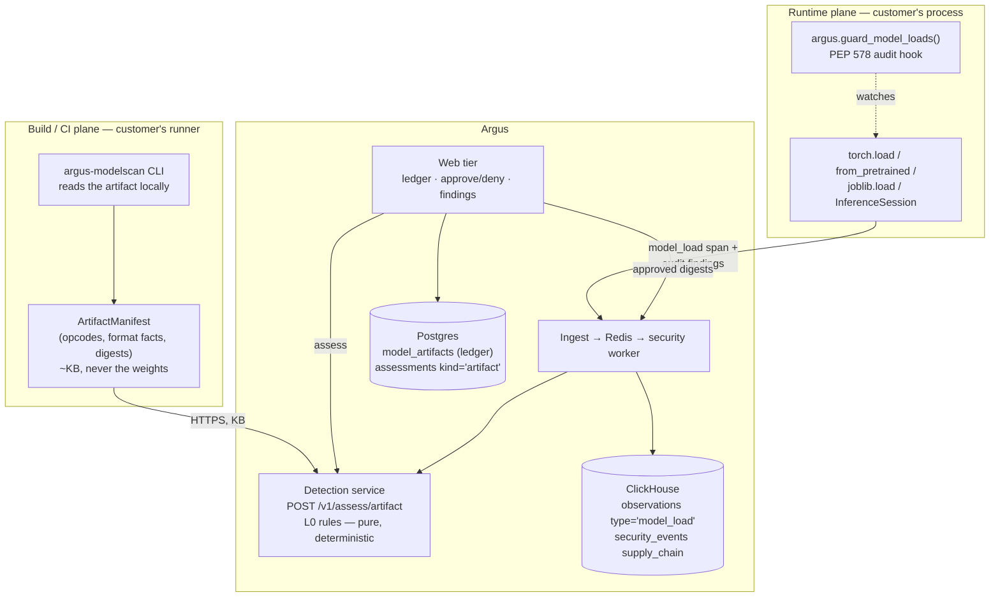

# 18 — Model Supply Chain (L0: Artifact & Load Integrity)

**Status:** Phases 0–1 complete · Phases 2–4 planned
**Owner:** TBD
**Related:** [04 — Security Detection Engine](04-security-detection-engine.md) ·
[05 — Data Model](05-data-model.md) · [13 — Feature Reference](13-feature-reference.md)

---

## 1. The problem

Argus watches conversations. Every detector in the platform reads text that
moved through a running application: a prompt, a retrieved chunk, a tool
result, a completion. L1 through L4 all sit on that plane.

The threat described in *"The Hidden Code Inside Your AI Models"* sits one
plane below it. It is not about what the model **says**. It is about what the
model **file does when it is opened**.

- Python's pickle format executes arbitrary code on load. This is documented
  behaviour, not a bug. Every `.pt`, `.pth`, `.bin`, `.ckpt`, and `joblib`
  artifact is a code-execution primitive wearing a tensor costume.
- The payload runs at `torch.load()` — before a single token is generated,
  before any Argus detector has anything to look at.
- Antivirus does not help. A YARA rule scanning a 4 GB weights file sees a
  wall of floats, and most scanners skip the file on a size cap anyway.
- "Model smuggling" is the delivery: swap the artifact behind a registry tag
  for one that is behaviourally identical and carries a payload. Nothing
  downstream notices, because nothing downstream was ever looking.

The article's own conclusion is the one worth building on: **static inspection
is necessary but insufficient; load-time behaviour is the practical detection
layer.** A process that spawns a subprocess, opens a socket, or calls `exec`
*during deserialisation* has no benign explanation.

### 1.1 Why this is Argus's problem specifically

Two reasons, one defensive and one strategic.

**The framework hole is already visible to customers.** `OWASP LLM05 — Supply
Chain Vulnerabilities` is in the framework registry at
[frameworks.py:16](../services/detection/argus_detection/assessment/frameworks.py:16)
and is cited by **zero** rules. Current citation counts across the engine:

| Requirement | Citations |
|---|---|
| LLM01 Prompt Injection | 13 |
| LLM08 Excessive Agency | 10 |
| LLM06 Sensitive Info Disclosure | 6 |
| LLM02 Insecure Output Handling | 5 |
| LLM07, LLM03, LLM04, LLM09, LLM10 | 1–2 each (catalog only) |
| **LLM05 Supply Chain** | **0** |

Every governance report Argus renders promises a framework row it cannot
populate. That is a defect in a shipped feature, not a new idea.

**Nobody else is doing the runtime half.** Static model scanners exist and are
free (picklescan, modelscan, fickling). What does not exist is *observability
of model loading in production* — an inventory of which artifact digests are
actually being loaded, by which service, when it changed, and what the process
did while loading it. That is an observability product's natural shape, and
Argus already owns the pipeline that would carry it.

### 1.2 Honest scoping — who this actually serves

State this up front so nobody oversells it internally.

A team that only calls hosted APIs (OpenAI, Anthropic, Bedrock) never loads a
pickle and gets **nothing** from Phase 3. The reachable population is:

| Segment | Exposure |
|---|---|
| Self-hosted / fine-tuned LLMs (vLLM, TGI, llama.cpp, local checkpoints) | Direct — loads checkpoints continuously |
| **Any RAG application** | Direct — `sentence-transformers` embedders and cross-encoder rerankers are pickle-backed and pulled from Hugging Face by name |
| Classical ML alongside the LLM (classifiers, routers, guardrail models) | Direct — `joblib`/`sklearn` is pure pickle |
| Pure hosted-API apps with no local model | Static scanning of nothing; ledger and controls only |

The RAG row is the one that makes this broadly relevant. Most "we just call
the API" applications are quietly running a local embedding model, and it
arrives by repo name over the network with no digest pinning at all.

---

## 2. Design principles

These are inherited from the existing engine, not invented here. They are what
keeps the feature from becoming a second product bolted to the side.

1. **Deterministic first.** The prompt scanner's contract — *"The engine is a
   pure function: same input → same findings"*
   ([engine.py](../services/detection/argus_detection/assessment/scanner/engine.py))
   — applies unchanged. Every L0 rule is a pure function of a manifest. No ML
   in the detection path.
2. **The detection service stays pure.** `assessment/__init__.py` commits to
   *"no DB, no network, no model calls."* The detection service must therefore
   **never read a model file or download from a registry.** File I/O happens
   at the edge (a CLI on the customer's machine); the service receives a
   kilobyte-scale manifest and returns findings. This is also the cheapest
   possible architecture — multi-gigabyte artifacts never cross a network we
   pay for.
3. **Additive only.** No existing table is dropped, no enum value is
   renumbered, no rule id is reused. Every schema change is an append.
4. **Reuse the taxonomy bridge.** Findings land in the existing
   `assessments` / `assessment_findings` tables via
   [taxonomy.py](../services/detection/argus_detection/assessment/taxonomy.py),
   so they appear in the Findings view, reports, and dashboards on day one.
5. **Never parse hostile input with the vulnerable parser.** L0 analysis uses
   `pickletools.genops` — which walks opcodes without executing them — and
   **never** `pickle.load`, `torch.load`, or `joblib.load`. A scanner that
   detonates the thing it is scanning is worse than no scanner.
6. **Fail open on scanning, fail closed on enforcement.** A scan error must
   never block ingestion or a deploy silently. An *enforcement* decision
   (CI gate, load block) fails closed and says so loudly.

---

## 3. Architecture

L0 sits below the existing layers: chronologically before L1–L4 (it fires
before inference exists) and structurally beneath them (it judges the artifact,
not the traffic).



### 3.1 Component map — what is new vs. reused

| Component | New? | Location |
|---|---|---|
| L0 rule engine | **new** | `services/detection/argus_detection/assessment/artifact/` |
| `POST /v1/assess/artifact` | **new** | `services/detection/argus_detection/app.py` |
| `argus-modelscan` CLI | **new** | `services/detection/argus_detection/cli/modelscan.py` ¹ |
| Load-time audit hook | **new** | `packages/py-sdk/argus/_loadguard.py` |
| `model_artifacts` ledger | **new** | `deploy/postgres/migrations/018_*.sql` |
| Findings storage | reused | `assessments` / `assessment_findings`, `kind='artifact'` |
| Risk scoring | reused | `assessment/risk.py` (`SCORING_VERSION`) |
| Taxonomy bridge | extended | `assessment/taxonomy.py` |
| Governance controls | extended | `apps/web/src/controls.ts` (`SUP-*`) |
| Trace/span storage | reused | `observations` with a new `type` enum value |
| Event storage, alerting, dedup, suppression | reused | `security_events`, `apps/worker/src/alert.ts` |
| Findings UI, reports, retention, redaction | reused | as-is |

¹ Shipped from the detection package rather than the py-sdk (Phase 1 decision 1)
so CI and the dashboard run byte-identical rule code.

Everything on the "reused" side is why this is a feature and not a second
product.

---

## 4. Detection design

### 4.1 The ArtifactManifest

The extraction/judgement split is the load-bearing decision. Extraction reads
bytes and is inherently I/O; judgement is pure. They are separated so the
detection service keeps its purity guarantee and so the same manifest can be
judged in CI, in the worker, or offline.

```python
# Produced by the CLI, consumed by /v1/assess/artifact. Kilobytes, not gigabytes.
class ArtifactManifest:
    path: str                  # relative, for display
    sha256: str                # of the file (or Merkle root for a directory)
    size_bytes: int
    format: str                # pickle|torch_zip|safetensors|onnx|keras_h5|gguf|joblib|unknown
    source_uri: str = ""       # hf://org/repo, s3://…, file://…
    revision: str = ""         # HF commit sha, S3 version id
    # --- format-specific facts, all deterministic ---
    globals: list[GlobalRef]   # (module, name, opcode_offset) from GLOBAL/STACK_GLOBAL
    opcode_summary: dict[str, int]
    archive_members: list[MemberRef]   # name, size, compress_type — for .pt zips
    tensor_keys: list[str]     # safetensors/onnx/h5 — for structure comparison
    declared_arch: str = ""    # config.json architectures[0] when present
    onnx_custom_ops: list[str]
    onnx_external_data: list[str]
    keras_layer_types: list[str]
    signature: SignatureRef | None   # sigstore bundle verification result
```

`globals` is the core of it. Every pickle payload must ultimately name a
callable via `GLOBAL` or `STACK_GLOBAL`, and `pickletools.genops` surfaces
those without executing anything.

### 4.2 The rules

Rule ids are stable identifiers that storage keys on. **Never renumber them** —
the same rule that already applies to `IG-PROMPT-001..020`.

#### Static artifact rules — `ARG-ART-###`

| Id | Rule | Default severity | Frameworks |
|---|---|---|---|
| ARG-ART-001 | Pickle GLOBAL resolves to a non-allowlisted module | critical | LLM05 |
| ARG-ART-002 | Direct execution primitive (`os.system`, `subprocess.*`, `builtins.eval/exec/compile`, `runpy`, `pty`) | critical | LLM05 |
| ARG-ART-003 | Network primitive during deserialisation (`socket`, `urllib`, `requests`, `httpx`) | critical | LLM05 |
| ARG-ART-004 | Filesystem write primitive (`shutil`, `pathlib.Path.write_*`, `open` with write mode) | high | LLM05 |
| ARG-ART-005 | Code-capable serialisation format used at all | ~~medium~~ **low** ¹ | LLM05 |
| ARG-ART-006 | Archive member path traversal or absolute path in a `.pt` zip | critical | LLM05 |
| ARG-ART-007 | Non-tensor member in a weights archive (`.py`, `.so`, `.sh`, executable bit) | high | LLM05 |
| ARG-ART-008 | Keras `Lambda` layer (embedded Python) | high | LLM05 |
| ARG-ART-009 | ONNX custom operator or `external_data` path escaping the artifact directory | high | LLM05 |
| ARG-ART-010 | Tensor keys inconsistent with declared architecture | medium | LLM03, LLM05 |
| ARG-ART-011 | Unsigned artifact where the project requires signatures | high | LLM05 |
| ARG-ART-012 | Digest absent from the project's approved ledger | high | LLM05 |
| ARG-ART-013 | Digest changed for a previously-seen `model_ref` (**smuggling**) | critical | LLM05 |
| ARG-ART-014 | Loader stack has a known-vulnerable version (torch/transformers/onnxruntime CVE) | high | LLM05 |
| ARG-ART-015 ² | Decode/decompress helper present (base64/zlib class) | medium | LLM05 |
| ARG-ART-016 ² | Malformed or undecodable serialised stream | high | LLM05 |

¹ **Demoted during Phase 0.** At medium this fires on every pickle-backed model
in the fleet, and a medium on everything is a filter people switch off. At low
it still answers the question SUP-2 is written against — *how much of our
estate could execute on load* — without competing with alerts.

² **Added during Phase 0**, appended rather than renumbered. ARG-ART-015 exists
because staged payloads (`base64.b64decode` → `builtins.exec`) should show the
decode step as corroboration, not as an alert of its own — `_codecs.encode`
appears in every protocol-0 pickle. ARG-ART-016 exists because "the walker gave
up" must never be rendered to a human as "the artifact is clean"; a stream
shaped to break naive parsers is a known evasion.

#### Load-time behaviour rules — `ARG-LOAD-###`

These fire on telemetry, not on files. Each maps to a PEP 578 audit event
observed **inside a load window**.

| Id | Audit event(s) | Severity | Note |
|---|---|---|---|
| ARG-LOAD-001 | `pickle.find_class` naming a non-allowlisted module | critical | Cannot be evaded by obfuscating the pickle stream — CPython raises this for every resolved GLOBAL regardless of how it was encoded |
| ARG-LOAD-002 | `subprocess.Popen`, `os.system`, `os.exec*`, `os.fork` | critical | No benign explanation |
| ARG-LOAD-003 | `socket.connect`, `socket.getaddrinfo` to a non-loopback address | critical | The article's headline signal |
| ARG-LOAD-004 | `exec`, `compile` | high | Legitimate in some import paths — see FP notes |
| ARG-LOAD-005 | `ctypes.dlopen` / `ctypes.dlsym` | high | Native payload path |
| ARG-LOAD-006 | `open` with a write mode outside the cache directory | medium | Persistence |
| ARG-LOAD-007 | Loaded digest not in the approved ledger | high | Runtime half of ARG-ART-012 |
| ARG-LOAD-008 | Digest drift for a `model_ref` seen before | critical | Runtime half of ARG-ART-013 |

`ARG-LOAD-001` deserves emphasis. Static analysis of a pickle stream can be
defeated — the opcode stream can be built at runtime, the module name can be
assembled from fragments. `pickle.find_class` fires at the moment the
interpreter actually resolves the name, after all obfuscation has unwound. It
is the pickle equivalent of a canary: not a judgement about intent, a fact
about what happened.

### 4.3 The false-positive problem — the single largest technical risk

**Legitimate model files use `REDUCE` and `GLOBAL` constantly.** A normal
PyTorch checkpoint references `torch._utils._rebuild_tensor_v2`,
`collections.OrderedDict`, `numpy.core.multiarray._reconstruct`,
`torch.storage._load_from_bytes`, and dozens more. A rule that fires on
"contains REDUCE" fires on **every model in existence** and the feature is dead
on arrival.

The detection quality therefore lives entirely in the allowlist, and the
allowlist must be:

- **Curated and versioned** — `artifact/allowlist.py`, with the version stamped
  into every finding the same way `scoring_version` is. A change to the
  allowlist changes verdicts and must be reproducible.
- **Framework-scoped** — the torch allowlist differs from the sklearn/joblib
  allowlist differs from the numpy one.
- **Validated against a real benign corpus before shipping** — see §7.

This is the thing that decides whether the feature is trusted or muted. It gets
the same treatment as the existing detection quality gate
(`services/detection/tests/test_quality_gate.py`), and it is why Phase 0
exists as a separate phase.

---

## 5. Open-source technology choices

Constraint: all open source, minimise cost, no new managed services, no new
datastores. Every line below is $0 and self-hosted on infrastructure Argus
already runs.

### 5.1 Core — zero dependencies

| Need | Choice | License | Why |
|---|---|---|---|
| Pickle opcode walk | **`pickletools`** (stdlib) | PSF | Walks opcodes without executing. No dependency, no license question, fully ours to test. **This is the core of L0.** |
| Load-time behaviour | **PEP 578 audit hooks** (`sys.addaudithook`, stdlib, 3.8+) | PSF | Native events for `exec`, `compile`, `import`, `os.system`, `subprocess.Popen`, `socket.connect`, `ctypes.dlopen`, and `pickle.find_class`. Zero dependency, zero infrastructure. **This is the differentiator.** |
| Archive inspection | **`zipfile`** (stdlib) | PSF | `.pt` files are zips |
| Digests | **`hashlib`** (stdlib) | PSF | |

The two pieces that matter most are both standard library. That is not an
accident of budget — it is also the right engineering answer, because it means
no supply-chain dependency in the supply-chain scanner.

### 5.2 Optional extras — same pattern as the existing `l2` extra

`pyproject.toml` already models optional capability
(`[project.optional-dependencies] l2 = [...]`). L0 follows it exactly, so a
minimal deployment carries none of this.

| Need | Choice | License | Notes |
|---|---|---|---|
| Corroborating pickle scanner | **picklescan** | MIT | Used by Hugging Face Hub itself. Safe to depend on directly. |
| Broader format scanner | **modelscan** (Protect AI) | Apache-2.0 | Covers H5, SavedModel, pickle. |
| Deep pickle decompilation | **fickling** (Trail of Bits) | **LGPL-3.0** | Most capable analyzer. **License review required before adoption** — keep it strictly optional and unmodified; do not vendor. |
| SafeTensors header parse | **safetensors** | Apache-2.0 | Header-only; does not pull torch. |
| ONNX graph parse | **onnx** | Apache-2.0 | Heavy; optional extra. |
| Keras H5 parse | **h5py** | BSD-3 | |

Design the ensemble so external scanners are **corroborating evidence behind
the same `Rule` interface**, never the primary signal — mirroring how L2
classifiers corroborate L1 rather than replacing them. Our own deterministic
walker must stand alone, or an upstream project's release cadence becomes our
detection quality.

### 5.3 Signing and provenance

| Need | Choice | License | Cost |
|---|---|---|---|
| Model signing | **OpenSSF `model_signing`** | Apache-2.0 | $0 — purpose-built for model directories, emits a Sigstore bundle |
| Keyless signing + verification | **Sigstore** (`cosign`, `sigstore-python`) | Apache-2.0 | $0 — OIDC-based, public Rekor transparency log, no PKI to operate |
| Attestation format | **in-toto / SLSA provenance** | open spec | $0 |
| Air-gapped fallback | **minisign** or **age** + detached signature | ISC / BSD | $0 — required; self-hosted customers are often offline and Sigstore's keyless flow needs internet |

Sigstore keyless is the cost story: signing infrastructure normally means
running a PKI. Here it means an OIDC round-trip and a public log.

### 5.4 SBOM and vulnerable-loader detection

| Need | Choice | License | Notes |
|---|---|---|---|
| SBOM generation | **Syft** → **CycloneDX 1.6** | Apache-2.0 | CycloneDX 1.6 has ML-BOM component types — the compliance artifact auditors ask for |
| CVE matching on the loader stack | **Grype** | Apache-2.0 | Covers the half of LLM05 that digest allowlists cannot: a pinned, signed, benign model loaded by a `torch` version with a deserialisation CVE. Feeds `ARG-ART-014`. |

### 5.5 Explicitly rejected

| Rejected | Why |
|---|---|
| **A sandbox detonation service** | The article recommends it. It is a container-orchestration product: pooling, timeouts, egress capture, resource limits, per-tenant isolation — high build cost, high ops cost, high infra cost. The audit hook obtains the same signals **in-process, in production, on real loads**, for zero infrastructure. If a customer wants detonation in Phase 4, they bring their own runner (`docker run --network=none --read-only`, gVisor, or bubblewrap) and post the manifest back; we do not operate it. |
| **YARA / ClamAV over model files** | The article explains why it fails. Gigabyte files, no text patterns, size caps. |
| **Crawling public registries** | Unbounded cost, no tenant value. Scan what is actually loaded — the SDK already tells us, and that is the observability angle. |
| **A new datastore** | Postgres + ClickHouse + Redis + MinIO cover every need here. |

---

## 6. Data model changes

All append-only. Nothing existing is modified or renumbered.

### 6.1 Postgres — `018_model_artifacts.sql` (Phase 2)

```sql
-- The provenance ledger: which artifact digests this project has approved.
-- Per project, not per org — "is this model approved?" is a property of an
-- application, matching governance_controls (016) and canaries (010).
CREATE TABLE IF NOT EXISTS model_artifacts (
    id             UUID PRIMARY KEY DEFAULT gen_random_uuid(),
    project_id     UUID NOT NULL REFERENCES projects(id) ON DELETE CASCADE,
    -- The stable name the application asks for ("sentence-transformers/all-MiniLM-L6-v2",
    -- "prod-reranker"). Digest drift is defined against THIS, which is what makes
    -- model smuggling detectable at all.
    model_ref      TEXT NOT NULL,
    sha256         TEXT NOT NULL,
    format         TEXT NOT NULL DEFAULT 'unknown',
    size_bytes     BIGINT NOT NULL DEFAULT 0,
    source_uri     TEXT NOT NULL DEFAULT '',
    revision       TEXT NOT NULL DEFAULT '',
    -- unsigned | verified | invalid | unchecked
    signature_status TEXT NOT NULL DEFAULT 'unchecked',
    signer_identity  TEXT NOT NULL DEFAULT '',
    -- pending | approved | denied | quarantined
    status         TEXT NOT NULL DEFAULT 'pending',
    approved_by    TEXT,
    approved_at    TIMESTAMPTZ,
    first_seen_at  TIMESTAMPTZ NOT NULL DEFAULT now(),
    last_seen_at   TIMESTAMPTZ NOT NULL DEFAULT now(),
    -- Denormalized rollup from the latest artifact assessment, so the ledger
    -- screen renders without joining findings.
    max_severity   TEXT,
    finding_count  INT NOT NULL DEFAULT 0,
    notes          TEXT NOT NULL DEFAULT '',
    UNIQUE (project_id, sha256)
);
CREATE INDEX IF NOT EXISTS idx_model_artifacts_project_ref
    ON model_artifacts(project_id, model_ref, first_seen_at DESC);
```

**Findings need no new table.** `assessments.kind` is free-text `TEXT NOT NULL
DEFAULT 'prompt'` with no CHECK constraint
([013_assessments.sql](../deploy/postgres/migrations/013_assessments.sql)), and
the web tier sets it per call site (`'prompt'`, `'graph'`). `kind='artifact'`
is additive with zero migration. `assessment_findings` maps cleanly:

| Column | Artifact meaning |
|---|---|
| `document_name` | artifact path |
| `rule_id` | `ARG-ART-###` |
| `affected_lines` | pickle opcode offsets |
| `evidence` | the offending `GLOBAL` reference, redacted |
| `frameworks` | `[{OWASP-LLM, LLM05}]` |
| `argus_category` | `supply_chain` |
| `risk` / `mitigations` | unchanged, from `risk.py` |
| `analyst_status` | unchanged (open/resolved/accepted) |

### 6.2 ClickHouse — `005_model_supply_chain.sql` (Phase 3)

Enum values are **appended**, never renumbered. Both are metadata-only
operations on `ReplacingMergeTree`, following the precedent set by
[004_event_source.sql](../deploy/clickhouse/migrations/004_event_source.sql).

```sql
-- A model load is a span. It has a start, a duration, a subject, and things
-- that happened during it — the same shape as every other observation — so it
-- inherits the trace UI, retention, redaction and tenant scoping for free.
ALTER TABLE observations
    MODIFY COLUMN type Enum8('span'=1,'generation'=2,'retrieval'=3,'tool'=4,
                             'event'=5,'model_load'=6);

ALTER TABLE security_events
    MODIFY COLUMN category Enum8('direct_injection'=1,'jailbreak'=2,
        'indirect_injection'=3,'exfiltration'=4,'excessive_agency'=5,
        'rag_poisoning'=6,'prompt_leak'=7,'pii_egress'=8,'canary_triggered'=9,
        'obfuscation'=10,'supply_chain'=11);
```

A `model_load` observation carries its facts in the existing `attributes` map
and `content_sha256`:

| Field | Value |
|---|---|
| `name` | the `model_ref` |
| `content_sha256` | the artifact digest — reuses the existing cross-trace correlation and alert-dedup key |
| `attributes['argus.model.format']` | `pickle` \| `safetensors` \| … |
| `attributes['argus.model.source_uri']` | `hf://org/repo` |
| `attributes['argus.model.revision']` | commit sha |
| `attributes['argus.model.loader']` | `torch.load` \| `from_pretrained` \| … |
| `attributes['argus.model.size_bytes']` | |
| `attributes['argus.load.audit_events']` | compact summary of what fired |

Each suspicious audit event also becomes a child `type='event'` observation
with `parent_id` set to the load span, so the trace view shows the load and
what happened inside it as a tree.

### 6.3 Taint — a deliberate non-change

A `model_load` span does not fit `system | user | untrusted_external | model`.
Rather than append a fifth taint class immediately, Phase 3 classifies
code-capable artifacts as `untrusted_external` — which is semantically
defensible (a third-party artifact *is* untrusted external content) and costs
no schema churn.

**This has a cross-layer consequence that must be handled in the same change.**
[pipeline.py:36](../services/detection/argus_detection/pipeline.py:36) escalates
to the L2 transformer classifiers whenever taint is `untrusted_external`. A
`model_load` span has no meaningful text content, so L2 would burn GPU/CPU on
an empty string for every load. `scan_observation` must branch on
`ObservationType.model_load` **before** the L1/L2 path and route to the L0
checker instead. Miss this and the feature ships a silent performance
regression into the classifier tier.

Revisit adding an `artifact` taint class only if the reuse proves confusing in
the UI.

### 6.4 Governance controls — extend the catalog

Appended to `CONTROL_CATALOG` in
[apps/web/src/controls.ts](../apps/web/src/controls.ts). New domain
`supply_chain`; no key collides with the existing `GOV-/INV-/PE-/RAG-/TOOL-/OUT-/HO-/TEST-/MON-` set.

| Key | Objective | Framework |
|---|---|---|
| `SUP-1` | Model artifacts are pinned by digest, not by tag | OWASP-LLM LLM05 |
| `SUP-2` | Code-capable serialisation formats are prohibited in production | OWASP-LLM LLM05 |
| `SUP-3` | Model registry access is authenticated and audited | OWASP-LLM LLM05 |
| `SUP-4` | Model artifacts are cryptographically signed and verified before load | NIST-AI-RMF MANAGE |

---

## 7. Phases

Each phase is independently shippable and independently valuable. Phase 1 needs
no SDK release, which matters because the SDKs are still unpublished.

### Phase 0 — Corpus and allowlist validation ✅ **COMPLETE**

**Goal:** prove the false-positive rate is survivable before building anything
around the detector. Ships nothing user-facing — this is a gate.

**Result — gate green at allowlist `1.1.0`:**

| Metric | Floor | Actual |
|---|---|---|
| Corpus size | ≥35 | **48** (24 benign / 24 malicious) |
| Recall on malicious corpus | 1.00 | **1.00** (24/24) |
| False positives at severity ≥ `high` | 0 | **0** |
| Detection-service suite | green | **217 passed** (was 162), ruff clean |

**Built:**

| File | Role |
|---|---|
| `assessment/artifact/types.py` | `ArtifactManifest` — the extraction/judgement seam |
| `assessment/artifact/allowlist.py` | DENY/ALLOW sets, versioned |
| `assessment/artifact/opcodes.py` | `pickletools.genops` walker + zip walk + format sniffing |
| `assessment/artifact/extract.py` | bytes → manifest (pure) |
| `assessment/artifact/rules.py` | ARG-ART-001..007, 015, 016 |
| `assessment/artifact/engine.py` | pure `scan_artifact(manifest) → findings` |
| `tests/artifact_corpus.py` | the labeled corpus, as a generator |
| `tests/test_artifact_quality_gate.py` | the gate |

**Decisions taken during the build:**

1. **`DECISION_SEVERITY = high`.** Zero-FP is measured at the band that alerts
   or blocks. Two findings sit deliberately below it: ARG-ART-001 (unrecognized
   global, medium) and ARG-ART-005 (code-capable format, low). Both are
   inventory signals. Counting them as false positives would have pushed the
   design toward suppressing them, and they are worth having.
2. **Unrecognized ≠ hostile.** Custom classes pickle as `module.Name` and are
   unallowlistable by construction — a class defined in a training script
   travels as `__main__.MyTransformer`. Escalating unknown to critical pages
   every research team on the planet for their own model. This is the single
   decision the whole FP result rests on.
3. **The corpus is a generator, not checked-in binaries.** Nobody can review a
   diff that says `fixture_07.pkl` changed by 40 bytes. Every artifact is
   assembled by readable code.

**Bugs found and fixed by the corpus, which is what it is for:**

- **Format sniffing ordered wrong.** A safetensors header of 93 bytes begins
  with `0x5D`, which is also the pickle `EMPTY_LIST` opcode. The generic
  protocol-0 pickle heuristic ran before the specific safetensors check, so
  roughly one safetensors file in a few hundred was misidentified as a pickle
  and then reported as a parse failure — on the exact format this whole layer
  tells people to migrate to. Specific checks now precede generic ones.
- **Allowlist gap on bare module names.** `tokenizers.` was allowed as a prefix
  but `tokenizers` was not a module, and `tokenizers.Tokenizer` is precisely how
  it appears in a real sentence-transformers checkpoint. Same gap for
  `xgboost`, `PIL`, `torchvision`, and six others (→ allowlist `1.1.0`).

**Mutation-tested — the gate has teeth.** Five deliberate breakages, all caught:

| Mutation | Result |
|---|---|
| Walker returns no globals | recall 1.00 → **0.12** |
| DENY list emptied | recall 1.00 → **0.21** |
| Unrecognized escalated to critical | **3 false positives** |
| `STACK_GLOBAL` refs dropped (the protocol-4 evasion) | **1 miss** |
| Zip archives not walked (the smuggling case) | **4 misses** |

**Carried into Phase 1:** the benign corpus is currently 12 authentic
(`pickle.dumps` of real objects) and 12 faithful reconstructions — correct about
*which globals appear*, which is all the allowlist judges, but not byte-identical
to real checkpoints. Before Phase 1 sign-off, add genuinely downloaded artifacts
(a sentence-transformers MiniLM, an sklearn joblib, a torchvision checkpoint)
behind a network-gated pytest marker so CI stays offline by default. Tracked as
a `TODO(phase-1)` in `tests/artifact_corpus.py`.

---

### Phase 1 — Static artifact scanner + CLI ✅ **COMPLETE**

**Goal:** a team can scan a model in CI and see findings in Argus. Closes the
LLM05 reporting hole.

**Definition of done — met.** `argus-modelscan ./pytorch_model.bin` on a
checkpoint carrying `os.system` inside `data.pkl` prints a critical
`ARG-ART-002` naming the offending archive member, and exits 1. The same
manifest through `POST /v1/assess/artifact` returns the finding enriched with
the LLM05 framework reference, a risk breakdown, and ranked mitigations, stored
as `kind='artifact'` for the Findings view.

**Shipped, no migrations · no ClickHouse change · no SDK publish:**

| Change | Where |
|---|---|
| `POST /v1/assess/artifact` | [app.py](../services/detection/argus_detection/app.py) |
| `assess_artifact()` orchestration | [assess.py](../services/detection/argus_detection/assessment/assess.py) |
| Manifest wire shapes | [assessment/models.py](../services/detection/argus_detection/assessment/models.py) |
| `Category.supply_chain` | [models.py](../services/detection/argus_detection/models.py) |
| `"supply-chain"` taxonomy bridge | [taxonomy.py](../services/detection/argus_detection/assessment/taxonomy.py) |
| 4 supply-chain mitigations | [mitigations.py](../services/detection/argus_detection/assessment/mitigations.py) |
| `argus-modelscan` CLI | [cli/modelscan.py](../services/detection/argus_detection/cli/modelscan.py) |
| `runArtifactAssessment` + `validateArtifacts` | [assessments.ts](../apps/web/src/assessments.ts) |
| `POST /api/assess/artifact` | [app.ts](../apps/web/src/app.ts) |
| Controls `SUP-1..4` | [controls.ts](../apps/web/src/controls.ts) |

**Verification:** 242 Python tests (was 217) · 135 TS + 12 extension tests
(was 121 + 12) · ruff clean · `tsc -b` clean · L0 gate still 24/24 recall, 0 FP.

**Decisions taken during the build, differing from the plan above:**

1. **The CLI ships from `argus-detection`, not the py-sdk.** Open question §10.1
   resolved. A CI runner has no business installing a *tracer*, but the deciding
   argument was drift: shipping the CLI beside the engine means CI and the
   dashboard run byte-identical rule code and cannot disagree about what the
   allowlist says. The cost is that `pip install argus-detection` pulls fastapi
   transitively. If CI image weight ever matters, the fix is an optional
   `[server]` extra — deferred rather than done, because moving fastapi out of
   the base dependencies today would break the existing Dockerfile, Makefile and
   CI job for no present benefit.
2. **The CLI judges locally by default; `--server` is opt-in.** The plan had the
   CLI extract and the service judge, always. In practice local judgement means
   a CI gate needs no service, no network and no credentials — which is most of
   what makes it adoptable — and the response carries `allowlist_version` so a
   stale CLI is detectable rather than silently authoritative. `--server` exists
   for when the deployment's allowlist is newer or the run should be recorded.
3. **Unreachable server exits 2, never 0.** A gate that passes because it could
   not reach its scanner reports "clean" for every build after the URL rots, and
   nobody investigates a green build.
4. **`walk_zip_archive` now accepts a path, not just bytes.** A checkpoint is
   routinely tens of gigabytes while its `data.pkl` is a few hundred kilobytes.
   Reading the archive lazily sets the scanner's memory cost by the pickle
   rather than by the weights.
5. **Oversized non-zip artifacts report a parse error, not silence.** Above the
   inline cap the opcode walk cannot run; rendering that as "no findings" would
   be a silent false negative on exactly the largest artifacts.
6. **Manifests are validated, and digests are required.** The body arrives from
   an unattended CI runner — the only assessment input that does. A manifest
   without a lowercase 64-hex digest is refused rather than stored anonymously:
   the digest is what a finding is *about* and what the Phase-2 ledger keys on.
   Uppercase is rejected rather than normalised, because the same artifact
   stored under two spellings would split its history and make the digest drift
   in ARG-ART-013 undetectable.
7. **The manifest's `globals` list is not persisted.** Findings keep their
   redacted evidence excerpt; retaining the full reference list would mean
   holding a map of the customer's proprietary model internals to no end. Same
   reasoning as prompt contents in `013_assessments.sql`.

**Not done in Phase 1 — CI cannot yet store a scan.** `POST /api/assess/artifact`
is a session route, and the public `/v1/*` surface only has `ingest` and `read`
scopes ([apikeys.ts](../packages/shared/src/apikeys.ts)). Submitting from CI
needs a third scope, which is a change to key creation, the UI, and
`parseScopes`. Deferred to Phase 2, where it lands beside the ledger CI actually
wants to write to. Until then CI gets the exit code (which is the gate) and the
dashboard gets the stored history.

---

### Phase 2 — Provenance ledger, drift detection, CI gate

**Goal:** approved-digest enforcement, and model smuggling becomes detectable.

- Migration `018_model_artifacts.sql`.
- Ledger CRUD in the web tier + a **Manage → Models** screen, following the
  Canaries admin pattern (view: member, approve/deny: admin).
- Rules `ARG-ART-011..013`. Drift falls out of the ledger for free: the ledger
  records first-seen digest per `model_ref`, so *"`prod-reranker` now resolves
  to a different digest and nobody approved it"* is a lookup, not an algorithm.
- Sigstore verification via the OpenSSF `model_signing` bundle format
  (optional extra), with a minisign/detached-signature path for air-gapped
  deployments.
- GitHub Action wrapper around the CLI for CI gating — runs on the customer's
  runner, so $0.
- `ARG-ART-014`: Grype over the loader stack, surfaced as a finding.

**Definition of done:** approving a digest, then scanning a swapped artifact
under the same `model_ref`, produces a critical `ARG-ART-013` and fails CI.

---

### Phase 3 — Load-time telemetry *(the differentiator)*

**Goal:** production visibility into what actually gets loaded and what happens
during the load. Requires a py-sdk publish.

- ClickHouse `005_model_supply_chain.sql` (enum appends).
- `packages/py-sdk/argus/_loadguard.py`:
  - `argus.guard_model_loads()` — opt-in, explicit, not enabled by `init()`.
  - Wraps `torch.load`, `joblib.load`, `AutoModel.from_pretrained`,
    `SentenceTransformer`, `onnxruntime.InferenceSession`.
  - Installs one process-wide PEP 578 audit hook that is **inert outside a load
    window** — a single flag check — because audit hooks cannot be uninstalled
    once added.
  - Emits a `model_load` span through the existing `Trace` transport
    ([_tracing.py](../packages/py-sdk/argus/_tracing.py)) plus child `event`
    spans for anything that fired.
  - Follows the SDK's absolute rule: never raise into the host app, degrade
    quietly (`cfg.warn_once`).
- Detection rules `ARG-LOAD-001..008`.
- `scan_observation` branches on `type == model_load` **before** L1/L2 (§6.3).
- Worker: no structural change — findings flow through `persistAndAlert` and
  inherit dedup, suppression, and per-project alert thresholds for free.
- **Alerting tier:** `ARG-LOAD-001/002/003` are canary-class. A canary hit
  needs no corroborating signal because there is no benign explanation; the
  same is true of `os.system` during `torch.load`. These page. Everything else
  follows the normal severity threshold.
- Ledger enrichment: loads seen in production populate `last_seen_at` and
  surface unapproved digests running right now.

**Definition of done:** a deliberately backdoored test artifact loaded in a
demo app produces a critical `supply_chain` event naming the audit event and
the artifact digest, visible in the trace view as a load span with the
offending child event, and pages through the configured channel.

---

### Phase 4 — Ecosystem and reporting

- ML-BOM export (Syft → CycloneDX 1.6) as a downloadable compliance artifact,
  reusing the existing `/v1/report` renderer.
- Registry webhook receivers (Hugging Face, MLflow) for scan-on-publish.
- Bring-your-own sandbox runner: documented `docker run --network=none
  --read-only` recipe that posts a manifest back. We document it; we do not
  operate it.
- Node SDK: provenance + digest only (see §8).

---

## 8. Known limitations — state these before anyone asks

| Limitation | Detail |
|---|---|
| **Node SDK gets half the feature** | JavaScript has no PEP 578 equivalent. `packages/node-sdk` can hash artifacts and report provenance, but cannot observe load-time behaviour. Do not promise parity. |
| **Audit hooks are permanent** | `sys.addaudithook` cannot be removed for the process lifetime. The hook must therefore be cheap when idle (one boolean check) and must be correct, because a bug in it is a bug for the whole process. Benchmark before shipping. |
| **Import-time payloads are out of scope** | A payload that executes when a *dependency* is imported, rather than when the artifact is loaded, falls outside the load window. That is ordinary Python supply-chain risk; `pip-audit`/Grype covers it, we do not. |
| **Not an antivirus** | L0 detects code-execution primitives and anomalous load behaviour. It does not detect a model whose *weights* were poisoned to misbehave — that is LLM03, a different problem, and not solved here. |
| **Static analysis is evadable** | Obfuscated or runtime-constructed pickle streams can defeat opcode analysis. This is precisely why Phase 3 exists; `ARG-LOAD-001` observes the resolution itself. Phases 1–2 alone are a partial defence and should be described that way. |
| **Directory-level artifacts** | Hugging Face models are directories, not files. Digest = Merkle root over a sorted file list; changing the hashing scheme later invalidates every stored digest, so fix it in Phase 1 and version it. |
| **Hosted-API-only customers** | Get controls, ledger, and reporting; get nothing from Phase 3 unless they run a local embedder (§1.2). |

---

## 9. Cost

| Item | Cost |
|---|---|
| Core detection (`pickletools`, audit hooks, `zipfile`, `hashlib`) | $0 — Python standard library |
| Optional scanners (picklescan, modelscan, safetensors, onnx, h5py) | $0 — MIT / Apache-2.0 / BSD |
| Signing (Sigstore, OpenSSF `model_signing`, cosign) | $0 — Apache-2.0, public Rekor log, no PKI |
| SBOM + CVE (Syft, Grype) | $0 — Apache-2.0 |
| CI execution | $0 — runs on the customer's runner |
| Artifact transfer | $0 — manifests are kilobytes; weights never leave the customer's machine |
| New datastores | none — reuses Postgres, ClickHouse, Redis, MinIO |
| New services | none — reuses the detection service and worker |

The only licence requiring review is **fickling (LGPL-3.0)**, and it is
optional by design. If review is unfavourable, drop it; the stdlib walker plus
picklescan (MIT) covers the same ground.

---

## 10. Open questions

1. ~~**CLI packaging**~~ — **resolved in Phase 1**: shipped from
   `argus-detection` as the `argus-modelscan` console script. Neither option
   originally listed won; drift did. Beside the engine, CI and the dashboard
   cannot disagree about the allowlist. See Phase 1 decision 1 for the cost.
2. **Directory digest scheme** — Merkle root over sorted `(relpath, sha256)`
   pairs is the obvious choice, but it must be pinned and versioned in Phase 1
   because every stored digest depends on it.
3. **Allowlist distribution** — shipped in the package (simple, requires a
   release to update) or fetched like a rule pack (updatable, adds a network
   dependency to a component that currently has none)? Leaning shipped.
4. **Gateway involvement** — should the gateway refuse to route to a model
   whose digest is unapproved? Powerful, but the gateway proxies API providers
   where digests do not exist. Probably out of scope; confirm.
5. **Enforcement mode** — should `guard_model_loads()` ever *block* a load
   (raise) rather than only report? Fail-closed is attractive and dangerous;
   default off, and it needs its own design note before it is built.
